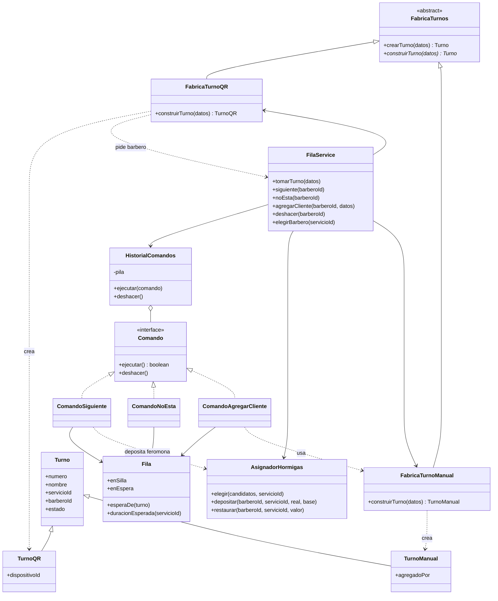

# Diagrama de clases

GitHub dibuja este diagrama automáticamente (Mermaid).

```mermaid
classDiagram
  class FabricaTurnos {
    <<abstract>>
    +crearTurno(datos) Turno
    +construirTurno(datos)* Turno
  }
  class FabricaTurnoQR {
    +construirTurno(datos) TurnoQR
  }
  class FabricaTurnoManual {
    +construirTurno(datos) TurnoManual
  }
  class Turno {
    +numero
    +nombre
    +servicioId
    +barberoId
    +estado
  }
  class TurnoQR { +dispositivoId }
  class TurnoManual { +agregadoPor }

  class Comando {
    <<interface>>
    +ejecutar() boolean
    +deshacer()
  }
  class ComandoSiguiente
  class ComandoNoEsta
  class ComandoAgregarCliente
  class HistorialComandos {
    -pila
    +ejecutar(comando)
    +deshacer()
  }
  class Fila {
    +enSilla
    +enEspera
    +esperaDe(turno)
    +duracionEsperada(servicioId)
  }
  class FilaService {
    +tomarTurno(datos)
    +siguiente(barberoId)
    +noEsta(barberoId)
    +agregarCliente(barberoId, datos)
    +deshacer(barberoId)
    +elegirBarbero(servicioId)
  }
  class AsignadorHormigas {
    +elegir(candidatos, servicioId)
    +depositar(barberoId, servicioId, real, base)
    +restaurar(barberoId, servicioId, valor)
  }

  FabricaTurnos <|-- FabricaTurnoQR
  FabricaTurnos <|-- FabricaTurnoManual
  Turno <|-- TurnoQR
  Turno <|-- TurnoManual
  FabricaTurnoQR ..> TurnoQR : crea
  FabricaTurnoManual ..> TurnoManual : crea
  Comando <|.. ComandoSiguiente
  Comando <|.. ComandoNoEsta
  Comando <|.. ComandoAgregarCliente
  HistorialComandos o-- Comando
  ComandoSiguiente --> Fila
  ComandoNoEsta --> Fila
  ComandoAgregarCliente --> Fila
  ComandoAgregarCliente ..> FabricaTurnoManual : usa
  ComandoSiguiente ..> AsignadorHormigas : deposita feromona
  FabricaTurnoQR ..> FilaService : pide barbero
  FilaService --> HistorialComandos
  FilaService --> AsignadorHormigas
  FilaService --> FabricaTurnoQR
  FilaService --> FabricaTurnoManual
```
