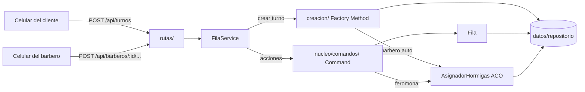

# Flujo de una petición

```mermaid
flowchart LR
  C[Celular del cliente] -->|POST /api/turnos| R[rutas/]
  B[Celular del barbero] -->|POST /api/barberos/:id/...| R
  R --> S[FilaService]
  S -->|crear turno| F[creacion/ Factory Method]
  F -->|barbero auto| H[AsignadorHormigas ACO]
  S -->|acciones| K[nucleo/comandos/ Command]
  K --> FI[Fila]
  K -->|feromona| H
  F --> D[(datos/repositorio)]
  FI --> D
  H --> D
```
